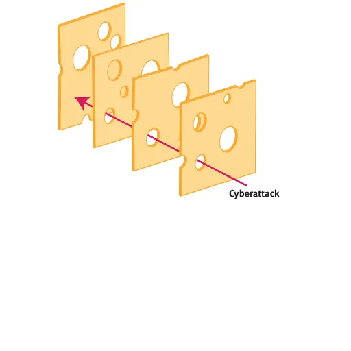

# Introduction
Welcome to the Defensive Security for Developers workshop. Today should provide you with an awareness of cyber security and the tools to think like an attacker to break and secure your code. We'll aim to acquaint you with the basics of ethical hacking - covering the main types of attacks, how they work, how they sneak their way into code and how to exploit them as well as identify and patch them before pushing to production.

The learning style is very hands on and the presentation is very minimal and clean, everything you need to know is here so there's no need to make notes, just relax and enjoy the workshop.

There's no pressure to understand everything and there **will** be things you don't fully understand on a deeper level that unfortunately I do not have enough time to cover in this short workshop. However further learning resources will be linked here if you're curious. This is your workshop just as much as mine, take from it what you want to. If the pace is too slow then feel free to skip ahead and likewise if it's too fast then feel free to send us a message on Leapchat to slow down. You'll also be able to catch up by reading this booklet.

# Exposed secrets in repos
Here we'll look at discovering exposed secrets in projects and how to defend against them.

## Hunting down secrets in GitHub repos!
There's plenty of ways to discover API keys, private keys and other treasures and not just by scanning through repositories. Inspecting the API's, URL interpretation and looking at the frontend code are just a handful of ways to grab those precious keys! We'll look at some of these later but for now we will scan GitHub repos to see if any secrets have been leaked in commits.

### What is Trufflehog?
To do this we'll be using an open source tool called Trufflehog. Trufflehog can do some very clever things. We'll be looking at **two** functions:
- Scan a specific GitHub repo
- Scan all repos for an entire GitHub user/ organisation

Trufflehog with iterate through all of these and identify potential and verified exposed secrets.

### Installation
There's several ways to run Trufflehog however the easiest way is to either install it on MacOS with `brew install trufflehog` or to run it with Docker (requires Docker to be installed and setup) `docker run --rm -it -v "$PWD:/pwd" trufflesecurity/trufflehog:latest github --repo https://github.com/trufflesecurity/test_keys` \*This might require super privileges i.e running with `sudo`.

You can also find instruction to compile it from source and run it from their [GitHub - https://github.com/trufflesecurity/trufflehog](https://github.com/trufflesecurity/trufflehog). I will be running it using Docker but this is just a preference.

### Scan a single repo for exposed secrets
To scan a single repository you can run `docker run --rm -it -v "$PWD:/pwd" trufflesecurity/trufflehog:latest github --repo https://github.com/trufflesecurity/test_keys` or `trufflehog github --repo https://github.com/trufflesecurity/test_keys` if you installed it.

### Scan all repos under a user or organisation
This command is an absolute gold mine. To run it use `docker run --rm -it -v "$PWD:/pwd" trufflesecurity/trufflehog:latest github --org=foundersandcoders` or `trufflehog github --org=google-deepmind`.

### Things to note
Trufflehog has *unverified* and *verified* secrets. Unverified means it could be a **false positive** and although it might be an API key, Trufflehog cannot be sure. Conversely a **verified** secret is confirmed to be a positive reading and definitely something of interest. Here are a few other things to bare in mind:
- Trufflehog can login to repos using SSH and Docker if they're private
- It doesn't just search *.env* files, it searches your code for embedded API keys too
- Can output JSON if you want it to
- Has the ability to work with local repos or check things before you push
- Has the ability to only output verified secrets and ignore unverified ones
- So much more - checkout the [README here](https://github.com/trufflesecurity/trufflehog) on their Github.

## How to hide your secrets
I think the most common cause for exposed secrets is a misconfigured *.gitignore* file as opposed them being hardcoded or extracted through complex attacks that hack into the server.

Another one is people sharing them in plain text over places like Discord, email etc.

Let's look at some basics of the *.gitignore file*

### What is the .gitignore file
For those of you that are unaware the *.gitignore* file typically lives in the root of your project and dictates what files are excluded from git commits. Typically these will be generated automatically if you're working with tools that generate a basic skeleton for you. They're useful for hiding *node_modules* directories and *.env* files.

Syntax such as:

```
# .gitignore file

node_modules
.env*
!.env.example
!.env.local
```

This file ignores all folders and files named *"node_modules"* in any directory as well as any file starting with *".env"* such as *".env.prod"*. The exclaimation marks act as a negate operator which creates an exception. This means that *".env.local"* and *".env.example"* **will** be included in git commits.

### Sharing API keys securely
If you have to share API keys please **do not** share them over plain text messaging services. In fact don't share them using messaging services **at all**. If your account is compromised it could lead to severe consequences. If you reuse your password then there's even more cause for concern. If a service you've used has been breached and your password has been leaked then attackers can try that password on other accounts. You can check your email at [haveibeenpwned.com](https://haveibeenpwned.com) for data breaches. Most of these leaked password can be found floating around on the internet if you know the right places to look. I suggest using 2FA and specifically an authenticator app or yubi key.

There's a service called *One Time Secret* which allows you to enter some text and then generate a link which can access that text. When the link is accessed the secret is deleted.

There's an open source version which you can self host called [Enclosed](https://github.com/CorentinTh/enclosed). This allows you to create a secret, encrypt it with symmetric encryption and even change the time it expires, if it should be deleted when accessed and you have the ability to attach files. I host an instance [here](https://secret.stopthestories.net).


Alternatively you could just use something like PGP - however this is a little less user friendly.

### Dealing with exposed secrets
It's important to note that if you've already exposed secrets, .gitignore won't remove these from your commits. When you've committed something it's basically permanent - unless you want to rewrite history which is messy!

If API keys are exposed you need to revoke them **immediately**!!!

You then need to purge commits if you can run an audit on anything that could have been accessed check if sensitve data has been exposed etc. There's a great open source tool which can make this really easy called [*BFG Repo Cleaner*](https://rtyley.github.io/bfg-repo-cleaner/) but you can also just use `git filter-repo`.

> Legally you need to notify users too if they're information has been breached.

As a general rule you should have API keys rotate every 90 days minimum. [*Rotating API keys*](https://blog.gitguardian.com/api-key-rotation-best-practices/) can automatically solve this. Many API key providers support them.

### A note about Svelte
[Svelte](https://svelte.dev) handles environment variables really well. It automatically prevents any environment variable from reaching client side code unless they're prefixed with *"PUBLIC_"* such as *"PUBLIC_ANON_KEY"*. Anything without this such as *"ANON_KEY"* will not be allowed to be exposed client by Svelte and can only ever be used server side. Very clever indeed!

# Developer Operations
There are many definitions for DevOps depending on who you ask but at it's core it combines development with operations, hence the name DevOps xD. I understand that's a circular definition so allow me to elaborate. At it's core it involves dealing with continous versioning, build and deployment. Here a some examples of things a DevOps engineer might carry out:
- Containerisation
- Deployment e.g. Docker, Docker Swarm, Kubernetes, Vercel, Terraform
- Load balancing
- Security e.g. firewalls, policies, levels of access, etc
- Cloudflare configuration
- AWS/ Azure configs
- Scaling

If that sounds confusing then don't worry, it's a loose term nowadays; it'll make more sense very soon.

## What is a server?
It's a word we use everyday but I think people might struggle to define it. Essentially a server is just a computer. In fact almost any computer can be a server. There's different types of servers such as *web servers*, *file servers*, *email servers*, *gaming servers*, *DNS servers*, *cloud servers* and plenty more. A single computer can host many services depending on the resources it has available e.g. CPU, RAM, GPU (usually necessary if doing complex tasks with data or AI), disk space etc.

Let's look at what a web server is and how it works. A web server listens for *http* traffic which typically runs on port 80. Generally a *client* such as a browser will request a path such as "/" (which would be the root of the site) this request is bundled up by the browser in a special way and sent to the server which looks at the *route*, *headers* and sometimes a *payload* and then responds appropriately with say an HTML page. The client recieves this and then the browser renders it accordingly.

The **route** is the site path e.g. *"/about"* this is important as the web server needs to know what part of the site we're talking about.

**Headers** are attached to each request whether *GET* or *POST* and they include information such as the type of text to accept, user-agent string (a string which your browser automatically sends to websites informing them about your operating system, browser and browser version) and cookies can be sent through headers too.

The **payload** is generally used for *POST* request data which contains form data or something you **wouldn't** want to encode into a URL. For instance running a **GET** request on "/login?user=bob&password=myverysecurepassword" would be a very bad idea so we send data to "/login" (or wherever) instead as a **POST** request and then this is sent separately to the server.

**GET** requests are simply requests to a URL with some headers and generally nothing else. Any data such as form data that the server recieves would have to be encoded in the URL somehow if the server is to retrieve it.

**POST** requests however are different. They send their data as a payload to the server and the data is not included in the URL. This is useful for things like a login page where you wouldn't want the username and password being included in the URL. We'll speak about this when we mention *MITM* (Man In The Middle) attacks later on. For now note that POST itself isn't inherently secure and TLS (Transport Layer Security) which is used by the *https* protocol is still required for this to be secure. Of course this doesn't eliminate vulnerabilities but it prevents MITM attacks which we'll cover later.

There are other types of requests such as **PUT**, **OPTIONS**, **DELETE** and more but you don't need to know about these for now. Additionally GET requests **can** technically have a body/ payload but this is almost unheard of and should never be done.

If you open your browser developer tools you can see requests going to and form the web page. This is the best way to get an understanding how these work so if the theory above didn't quite click then don't worry.

## Quick rundown on what a protocol is
Simply put a protocol is a set of standards which dictate how information is handled. This includes how it's sent and how it's recieved. Protocols are great! For instance the Simple Mail Transfer Protocol (SMTP) is a set of rules and instructions explaining how we package up emails and send them to an email server. The protocol also explains to the email server how to unpackage the data, verify it's integrity and what to do in different scenarios. This is an abstraction of course but the benefit of this is that Google Mail and Outlook can both communicate via the SMTP protocol without being the same platform. We love that!

Email is decentralised meaning that unlike something like WhatsApp you can choose from an infinite number of email providers or even create your own. They can all communicate with each other **without** a *central server*. This structure is something I am very fond of as it allows for more freedom; if you don't like Gmail because of the way it looks or the fact they used to scan your emails to advertise to you, or maybe the fact they used to put fake emails at the top of your inbox that were actually adverts then you can create your own email and it can look and behave however you like. There's no vendor lock-in here.


## UDP and TCP magic?
You don't really need to know much about this but I mention it lightly throught this guide to if you're interested then here's an explanation.

To keep things simple, there are pretty much only two types of network traffic: UDP and TCP. These are packets (or chunks) of data which are sent around the internet.

I won't get into what TCP and UDP traffic is too deeply but essentially they're different protocols which tell to computer who to send and recieve data **UDP** traffic isn't guaranteed to arrive. It's used for things like VoIP (Voice over IP, or WiFi calling) or Facetime where *packets* can be dropped without much consequence. Typically traffic with low-latency and real time goes through UDP. TCP on the other hand is for things like text, http/s, ssh, etc where you don't want to be losing data. In fact TCP carries out checks to ensure *data integrity* - this is part of the TCP protocol where the client sends over the packets (basically chunks of data with headers such as the order and stuff) and then the when they're recieved there's a check to ensure they're all there. UDP and TCP can get very complicated though and there's not much need to get bogged down with it if you don't need to.

## What's all this speak about ports?
Well when we send traffic to and from a server we generally send it via a specific port. This is useful because then when the traffic is recieved it knows where to go. Let's assume you were running an *SSH server* on port 22 (the default SSH port) and a web server on port **443** - the default https port. If we were to send a request to the computer it wouldn't know whether it was for SSH or the web server. This would be very confusing. As a result we generally have one service running on a single port when it comes to **TCP** traffic, **UDP** traffic is slightly different. This does get more complicated later but that's the general idea.

If you're still struggling to understand it then see the diagram below. Imagine each piece of traffic being a boat carrying different types of cargo e.g. food, clothing, technology, etc. Each boat gets it's own berth (we'll call this a port) which it can dock in and out of. The clothing boat goes to the clothing port at the harbour so that it's contents can be put straight onto a lorry which takes them to various clothing stores. If we had all the boats coming into the same port then this would be so confusing because we wouldn't know what each boat was coming for and how to process it when it arrives.


## Firewall shinanigans
Your computer (and your servers operating system) will likely have **many, many** services running on lots of different ports. You won't even know about lots of them. If we expose your VPS (your main server not just a web server running on it) to the internet then anyone can connect to your machine and interact with these ports.

### Inbound and outbound
You might here this come up, essentially **inbound** connections are others connecting to your machine and **outbound** connections are ones your machine makes. Most often we don't care too much about **outbound** connections but we very much care about connections coming into our machine. When you run `sudo ufw allow 22` for instance this allows all **inbound** connections through port 22. Note that By default UFW **doesn't** block any outbound connections.

### How do fireqalls work?
Let's say your *Postgres database* is running on port 5432 on your machine. In this scenario clients never need to connect to the database directly. When they make a request to say "/dashboard" the backend server automatically picks up the *JWT* (more on this later) from the server to authenticate the user, internally contacts the Postgres database to grab the user data and then sends it back to the client. As you can see only the backend server needed to communicate with Postgres. If anybody was able to communicate with Postgres then they could do some pretty bad stuff right? Especially if you used weak credentials or default ones. They could just go to your server's IP address and contact it directly. What if there was a vulnerability in a service running on your machine or even in Postgres? This could mean that the attacker can communicate with it in a specific way to access things they shouldn't. This could mean accessing your entire operating system and everything running on it! We don't want this!

A firewall is perfect to prevent this. It has a set of rules which dictate what traffic comes in and what comes out. Most devices and routers run firewalls by default. Firewalls run on an operating system or firmware and monitor all traffic coming in and out and only allow it to come through if it meets the rules set by the systems administrator. If we setup a firewall which only allows access to port 443 (the https port) then even if there is a Postgres database running on port 5432 it won't be able to communicate with anything outside of the local network, keeping it safe. Fortunately our web application running on port 443 will still be accessible to the world.

Most routers run firewalls. This means that even if devices have exposed ports, the router will stop them being accessible. Your router gives you access to the internet. It routes traffic. You most likely have one at home with Sky, BT or another Internet Service Provider. This means if you wanted to run a web server which is accessible to the world you'd need to expose port 443 (or whichever port you're running the web server on) on your server and then **additionally** expose it on your routers firewall. Most VPS's you rent will not have a router firewall so you need to be very careful and make sure your VPS itself is running one.

> Note that it's okay to expose some ports but we want to minimise the amount of "holes" in our system to reduce to attack surface. The less we give attackers the harder it is to get in. Think of it as reducing the amount of doors and windows in a building. If we have lots of **different** doors and windows surrounding our building then there's so many more opportunities for attackers or bad actors to exploit issues with the doors such as the hinges being on the outside, letterbox being open, lock being easy to crack etc. By reducing it to one or two doors we can keep a good eye on what's happening with those doors and focus on ensuring they're secure.

### The Swiss Cheese model
A nice analogy used in various fields is the Swiss Cheese model. In Cyber Security it relates to the amount of holes in our system and how reducing them reduces attack vectors.



### Setting up a firewall
The simplest firewall and most widely used firewall on servers is called **UFW** it stands for "Uncomplicated Firewall". On Ubuntu live (the most popular operating system for servers) this is installed but **not** enabled by default. If it's not installed just run `sudo apt install ufw` on debian based distributions or `sudo pacman -Syu ufw` on Arch based distros. To enable it so it's running and listening for traffic run `sudo ufw enable`. This will run on boot. You can see the current firewall rules by running `sudo ufw status` or even see them listed as numbers with `sudo ufw status numbered` - you'll see why this is useful later on.

Let's allow port 22 for SSH by running `sudo ufw allow 22`. I personally prefer `sudo ufw allow 22/tcp` which only allows **TCP** traffic.

We can also delete rules using UFW with `sudo ufw delete 1`. This will delete the first rule. Hopefully now you can see why the `sudo ufw status numbered` command is useful as it allows us to see the position of a rule in the list which we can later use for things like deleting. You can also reset it with `sudo ufw reset` but please note this will deactivate it and you’ll need to run `sudo ufw enable` again to reinstate it.

That's the basics of UFW :D

## Stop running as root! PLEASEEEE
Okay so you want to run something on your machine. WHY ARE YOU RUNNING IT AS ROOT! Root is the administator, it has pretty much full access to the entire system, the firewall, users, files, packages, everything! It has full control over everything! If you run something as root and it happens to get compromised then it's possible that an attacker could have full access to your entire machine. Nevertheless it's very bad practice. If you're running as root then you might accidentally do something that could harm your system, running sudo makes you think twice. Nonetheless it's messy! If you have lots of things running as root in the root directory then it's a nightmare. Also...all those programs are running as root so they have access to every file on the system, read, write and execute permission!

### Hmm, these users and groups sound pretty good
We can create users and assign them specific priveledges. We tend to assign these using groups. For example users added to the *"sudo"* or *"wheel"* group (depending on your configurations) will have super priveledges. In Linux everything is a file. Commands are no different, they're executable files. You can even create your own command which takes arguments, it can be a bash/ shell script, a binary or something else. You can add it to `/usr/local/bin` and then it will become globally available in your terminal. Main programs are stored in `/usr/bin` but it's good practice to put any binaries **you** make in the **usr/*local*/bin** folder. Regardless it is just a file. Files can have **read**, **write** and **execute** permissions such as "Only root can run this" or "Only users in the whatever group can read this (but not execute or write/ modify)". In Linux you can create a group and call it anything you like but there are some predefined ones which tend to come out of the box like sudo or wheel.

## Creating a user
To create a new user we need to run `useradd -m -G sudo bob` - run this with something like sudo if you're not root. The useradd command adds a user. The *"-m"* flag creates the user a directory in the home folder - in this case it would be "/home/bob" - this is important because if you suddenly tried to switch to bob you wouldn't even be able to run `ls` to list the files in the current working directory. This is because at this stage almost every file on this system is owned by root and only root has read, write and execute access . It also gives bob permission to access this folder. The *"-G"* flag stands for "group" and in this case adds the user to the **sudo** group so they can access sudo. Finally the users name "bob" is added.

Great so we've created bob but how do we login to bob? Well first I think it would be good to give bob a password. To do this run `passwd bob`. You'll then be prompted to enter bob's new password twice. This command can also be run if bob forgot their password which would allow root (or another user with super priviledges) to change bob's password for them.

To login to bob run `su bob`. `su` stands for "switch user". You might be prompted to type in the password to bob depending on various things. If you wanted to return to root (or the user you were before) you could simply run `exit` or `su root`. If you ever forget root's password or don't have it then you can always run `sudo su` which will switch the user to root.

## Now what?
Well your server is hopefully a lot more secure now than it was when it first booted. We'll look at secure SSH, reverse proxies and containorisation next to ensure everything you decide to run on your machine stays safe and secure.

## SSH
SSH stands for Secure Shell. As you might already know, a shell is a place where you can execute commands to interact with your system. SSH allows you to access the shell of another system remotely. Before SSH there were only protocols like Telnet which weren't very secure or even encrypted. This meant that all the traffic could be *"sniffed"* meaning that all the commands sent the machine could be read. Because they weren't encrypted it also made them vulnerable to MITM (Man In The Middle) attacks too. Telnet had many other vulnerabilties though.

There's two things required for SSH: an SSH server which is a server running an SSH daemon and then a client which can connect to that SSH server. OpenSSH is the standard for this, it's a suite of tools which offers both an SSH daemon called *"sshd"* and a client called *"ssh"*.

I'd like to note that SSH can do **A LOT** more than just provide a shell. It can do *tunnelling*, *X-11 forwarding* (which allows you access graphical applications running on your server) and so so much more.

### Installing an ssh server
If you've setup a VPS then you already have everything you need installed. Otherwise run `sudo apt install openssh-server` on your machine to install it. You can check if it's running with `sudo systemctl status sshd`. Note that some strange VPS providers use other SSH daemons or configurations so sometimes you need to run `sudo systemctl status ssh`.

> Don't ask me why this is, it's ridiculous because **ssh** is the client tool. I once had an issue where I had a VPS provider install **another** SSH server **on top** of the default openssh-server meaning two different servers were running. This meant that when I ran `sudo systemctl restart sshd` to reload my ssh server configuration file that we'll be changing soon, nothing happened and my changes didn't take effect. This is because although openssh-server (sshd - which I just restarted) was running they'd configured it to use this other ssh server which goes by the name of "ssh". So for my changes to take effect I needed to run `sudo systemctl restart ssh`. Absolute rubbish! Don't worry if none of that made any sense, I'm yapping!

### Editing the SSHD config file
The configuration for your SSH server is held at `/etc/ssh/sshd_config`. I suggest you make a backup of this file before editing it so that you can restore it if necessary. To make a backup run `sudo cp /etc/ssh/sshd_config /etc/ssh/sshd_config.bak` - you now have a copy of the original file with a ".bak" extension. You can put backup anywhere you like and call it anything you like but I find this rather conventional.

#### Changing the default port
The first thing I recommend changing is the SSH port you use. This isn’t necessarily something that should be relied on to protect you as it’s *security through obscurity* however if there are vulnerabilties in OpenSSH (which there have been in the past) then there’s a smaller chance automated bots will find your SSH server. This is because they traditionally look for port 22 which is the defualt SSH port. Of course they can scan for other ports on your machine and try to establish an SSH connection but this is less likely.

Another benefit is that it will keep your logs (found with `journalctl -u ssh`) down as they will get rather big if they’re logging automated attacks which try to authenticate with your SSH server. Fortunately they likely won’t reach your actual SSH port and so the only logs generated will generally be from your own activity which often is smaller than a hundred or so requests a day from bots. To do this change `#Port 22` to `Port 7845` or whatever port you choose.

#### Disable root login
There’s a line which says: `#PermitRootLogin prohibit-password`. Adjust this to `PermitRootLogin no`. This prevents logging into root (essentially the admin account) via SSH. Much safer! Note that it is possible to only allow specific users to be signed in via SSH but that’s out of the scope of this guide and not really necesssary.

#### Disable password authentication
Another crucial line to change if not the most important is: `#PasswordAuthentication yes`. This needs to be set to: `PasswordAuthentication no`. Wonderful! This is because we don't want someone being able to just guess your password. Authenticating with keys will be much much safer. Don't worry if you don't understand this yet, it'll all make sense soon.

### Generate some SSH keys
At this point it would probably be a good idea to generate some SSH keys. On your client machine (the one you want to use to connect to your SSH server) run `ssh-keygen` set the filename to something memorable such as “myserver” and press enter. Then add a password - this encrypts your private key with symmetric encryption, ensuring that even if somebody got hold of it, they’d be unable to access your SSH server (providing the password was strong enough). It’s an extra step but isn’t necessary as long as you feel the files on your computer are secure!!! Are they!?

Type `ls` into the terminal and you should see two files `myserver` and `myserver.pub` (or whatever you named them). Move these to the .ssh folder in the home directory using the following command `mkdir -p ~/.ssh/keys && mv myserver myserver.pub ~/.ssh/keys` - this command makes the .ssh directory in the home folder if it doesn’t already exist and then moves the ssh keys to a folder called “keys” inside of the .ssh directory. Your directory structure should look like this:

```
.ssh
└── keys
    ├── myserver
    └── myserver.pub

2 directories, 2 files
```

> `~` means the users home directory, it's shortcut. So `cd ~/Documents` would be equivalent to`cd /home/bob/Documents`.

Now let’s change the permission of the files to ensure they’re kept extra safe `chmod 600 ~/.ssh/keys/*`. This ensures **only** the owner of the file has read and write permission.

The `myserver` file is the private key (this must be kept secret and **NEVER** shared with anyone else). The `myserver.pub` key is the public key and this can be shared anywhere **without** consequences. We need to take the contents of `myserver.pub` and append them (add as a new line) to a file on our server found at `~/.ssh/authorized_keys`. This file lives on the **server** you want to connect to and contains a list of **public** keys from clients who want to connect. Each line in this file is a different public key. This means I can share my public key on say GitHub and anybody can append it to their SSH server with no issues.


Feel free to add this to GitHub or a pastepin service and download it onto the server. I recommend copying the files contents as follows: `cat ~/.ssh/keys/myserver.pub`. Make sure to copy this exactly and create a paste here. You should have a link like this https://pastebin.com/raw/VAuQ6qta (note the raw part of the URL is rather important for the next step). Now go to your server and execute the following `curl https://pastebin.com/raw/VAuQ6qta >> ~/.ssh/authorized_keys`. Curl will grab the contents and then add it as a new line to the authorized_keys file (and create the file if it didn’t already exist). Note that >> means append but > means overwrite (which is only harmful if you already had keys in there).

> The `>` greater than character means take the output of the command on the left and send it something on the right. For example `echo "Hello World" > hello.txt` would write "Hello World" to a new (or existing) file called "hello.txt". If this file already had contents inside it will **overwrite them**. This is **destructive**. The double greater than symbol will write the output to a **new** line; therefore `echo "Hello World" >> hello.txt` would create the file if it didn't exist, but if it did exist with contents then it would ensure that the new content is added as a new line.


Now it’s time to start your SSH server with `sudo systemctl enable sshd --now`. If it was already running then run `sudo systemctl restart sshd` to restart the server and allow the new configuration changes to take effect.

### A note about firewalls

You’ll also need to change any firewall settings. Allow your SSH port with `sudo ufw allow 7845/tcp` (or whatever port you chose). Run `sudo ufw status` to verify it's taken effect and your firewall is up and running. To delete the rule run sudo ufw status numbered and then sudo ufw delete NUMBER where “NUMBER” is the rule you wish to delete.  If you want to establish an SSH connection outside of your home network then you’ll also need to *port forward* (open up the port on your routers firewall) the appropriate port.

> If you already had port 22 exposed then make sure to close it back up with `sudo ufw delete allow 22/tcp`

If all is well you should be able to log in on your client machine with `ssh -p 7845 -i ~/.ssh/keys/myserver myserverusername@myIPAddress`. The `-p 7845` stands for the port you wish to use (if you didn’t change it from 22 you can leave this out) and `-i` specifies the identity file (associated **private key**) required to authorize the connection.

### Setting up Fail2Ban
Fail2Ban is a great piece of kit designed to mitigate brute-force attacks - where an attacker will try different combinations until they guess the right password/ key to gain access. Essentially it allows us to ban an IP address of an attacker using various rule-sets. To install it run `sudo apt install fail2ban`. Now the configuration file can be found at `/etc/fail2ban/jail.conf` however when the package is updated this will be overwritten and there it’s not recommended to edit this file directly. Instead create a copy in the same directory called `jail.local`. To do this run the following command: `sudo cp /etc/fail2ban/jail.conf /etc/fail2ban/jail.local`. Now you can edit the file using administrator privileges. Under the “Jails” section you should find sshd. As shown below:

```
#
# JAILS
#

#
# SSH servers
#

[sshd]

# To use more aggressive sshd modes set filter parameter "mode" in jail.local:
# normal (default), ddos, extra or aggressive (combines all).
# See "tests/files/logs/sshd" or "filter.d/sshd.conf" for usage example and details.
#mode   = normal
port    = ssh
logpath = %(sshd_log)s
backend = %(sshd_backend)s
```

If you changed the SSH port in the previous step then adjust that here e.g. `port = 7845`. I recommend changing the bantime to at least an hour. To do this edit the following:

```
# "bantime" is the amount of time that a host is banned, integer in seconds or
# time abbreviation format (m - minutes, h - hours, d - days, w - weeks, mo - months, y - years).
# This is to consider as an initial time if bantime.increment gets enabled.
bantime  = 10m

# A host is banned if it has generated "maxretry" during the last "findtime"
# seconds.
findtime  = 10m

# "maxretry" is the number of failures before a host get banned.
maxretry = 5
```

You can adjust bantime to your liking e.g.` bantime = 1h` will set it to one hour. There’s a lot more you can do with fail2ban and formulas you can tinker with which dynamically change the ban time expondentially for repeat offenders but we’ll leave it there for now. Save the file and run `sudo systemctl enable fail2ban --now` or `sudo systemctl restart fail2ban` if you were already running it.

To test this works you can actually abuse your SSH server and see if you get banned (although I recommend setting the bantime to 1m if you’re going to do this). To test it, simply try to login to your SSH server with the wrong username and identity key (more on that later) several times.

If you try to login with root it should fail, it you try to login without a key it should fail and if you try to login with the wrong username it should fail. If you fail enough times then your IP will be banned for the specified time period. I suggest using a VPN to try logging in and banning yourself. This means you can change to a new IP which will allow you to login again.

You can see the status of bans by running `sudo fail2ban-client status sshd`.

### Managing SSH keys

Running `ssh -p 7845 -i ~/.ssh/keys/myserver myserverusername@myIPAddress` can become rather tedious, especially if you need to connect to multiple machines, remember all of their identity files, individual ports etc. To mitiate this create a file in `~/.ssh/config`. Inside add the following:

```
Host myserver
    User myserverusername
    Port 7845
    IdentityFile ~/.ssh/keys/myserver
    HostName myIPAddress
```

This then allows you to run `ssh myserver` and you’ll be able to connect to your server just like that. Note that the name “myserver” is whatever you specify as the “Host” - you can literally call it anything and it can be different from the key names or username.

To add more ssh connections edit the file as follows:

```
Host myserver
    User myserverusername
    Port 7845
    IdentityFile ~/.ssh/keys/myserver
    HostName myIPAddress
Host linode-vps
    User oden
    Port 5034
    IdentityFile ~/.ssh/keys/linode
    HostName 203.0.113.45
```

We can now connect to our VPS with `ssh myserver` or `ssh linode-vps`. Your SSH client will look for this config file so it's important to make sure it's in the `~/.ssh` directory.

## Congratulations 🥳

Well done! You have successfully (I hope) set up SSH securely and learnt to manage SSH keys. If you’d like to create an SSH connection without port forwarding or firewall rules then I suggest looking into [Cloudflare tunnels](https://developers.cloudflare.com/cloudflare-one/connections/connect-networks/use-cases/ssh) or [TailScale](https://tailscale.com/kb/1193/tailscale-ssh).

Additionally it's useful to note that lots of people use [Wireguard](https://wireguard.com) to access their servers securely but this still involves exposing a port for the wireguard server. Wireguard is a VPN. By running a VPN on your server and then connecting to it securely from your client machine you're able to access the servers closed off local network. So then you could just run `ssh 127.0.0.1`. This is what VPN's are really great for in security!

> 127.0.0.1 is a special IP address called a *"loopback"* address. It basically means *"localhost"* or "this computer's IP address".

## Computer Science in 5 minutes
I don't expect any of you to understand this but it helps sometimes to know how things work on a low level and when we speak about *kernel's* you'll have no idea what it does without understanding some Computer Science fundamentals.

CPU's understand a very limited instruction set. They can add numbers, subtract, store something temporarily and then manipulate memory (RAM).

When you write code it's always put down into machine code. Other people have made compilers which turn your lovely `print(5+7)` to machine code. So what is machine code?

Let's take look at Assembly Language. This is what is used at the lowest level. It was created by Ada Lovelace who made the first programming language.

If we want to add two numbers we need to execute the following Assembly Code
```
        INP  // Take an input
        STA 99  // Store it in RAM slot 99
        INP  // Take another input
        ADD 99  // Add that input to the number in RAM slot 99
        OUT  // Output the sum
        HLT  // Halt the program, we're finished
// Output the sum of two numbers
```

You can run it here to see an animation of it running each instruction and where data travels through the CPU: [https://peterhigginson.co.uk/lmc](https://peterhigginson.co.uk/lmc). In RISC architecture (Reduced Instruction Set Computing) there's not really any sort of multiplication or modulus. It's very very simple.

Each instruction from RAM can be executed in a single Fetch, Decode, Execute cycle. This is where the CPU is fetching instructions or data from RAM, decoding it from RAM (depending on the architecture data **and** instructions can be in the same RAM slot so sometimes it needs to split them, there's more to decoding too) - executing the instruction, such as `LDA A`; load "A" into the accumulator - which is the thing that adds up. So if we wanted to do `print(5*2)` we'd have to do the following:

Let's look at a JavaScript example of this first:

```js
function multiply(x, y) {
    let result = 0;
    for (let i = 0; i < Math.abs(y); i++) {
        result += Math.abs(x);
    }
    if ((x < 0 && y < 0) || (x > 0 && y > 0)) {
        return result;
    } else {
        return -result;
    }
}

// It being used
let num1 = 4;
let num2 = 5;
let result = multiply(num1, num2);
console.log(`The product of ${num1} and ${num2} is: ${result}`);
```

As you can see we define a `result` which we add to by `num1`, then decrease `num2` by one and repeat to do so until `y` is zero.

Here's the same code in Assembly Language. Each line is an instruction which can be executed in a single cycle.

```
        INP  // Take the first input (multiplier)
        STA 99  // Store it in RAM slot 99
        INP  // Take the second input (multiplicand)
        STA 100 // Store it in RAM slot 100
        LDA 0   // Load 0 into the accumulator
        STA 101 // Store 0 in RAM slot 101 (result)

LOOP:
        LDA 100 // Load multiplicand into accumulator
        BEQ END // If multiplicand is 0, go to END
        ADD 99  // Add multiplier to result
        STA 101 // Store new result
        LDA 100 // Load multiplicand into accumulator
        SUB 1   // Decrement multiplicand
        STA 100 // Store new multiplicand
        JMP LOOP // Jump back to LOOP

END:
        LDA 101 // Load result into accumulator
        OUT     // Output the result
        HLT     // Halt the program
```

Now we understand how the JavaScript code works lets use it to help us decipher this Assembly. I'll be referencing the variables we used in our JavaScript code to help you.

- You can see it first defines the RAM slots for each part of the program; `num1`, `num2` and `result` in JavaScript.
- It then loads up `num2` into the accumlator (a part of the CPU which adds numbers)
- Checks if `num2` is zero (`BEQ` - branch if equal to zero to the `END` block of code)
    - If **not** adds `num1` to the result.
        - It then stores the new result
        - Loads up `num2` into the accumulator
        -  Decrements `num2` by 1.
        - It then overwrites `num2` with the updated number
        - Jumps (`JMP`) back to the top of `LOOP:` where it will start again until `num2` is equal to zero
    - When `num2` is equal to zero it immediately **jumps** to the the `END:` block
    - It then loads the result
    - Outputs it
    - Exits program


> Note that `LOOP` could be called anything, it's just a name.

Here you can see how instructions from the RAM telling the CPU what to do:


Here you can see this C code being put into instructions which are added to RAM and then executed by the CPU.

### More detail on RAM, decoding and Program Counters

For our purposes RAM is just a list of instructions. RAM can be encoded in different ways but I'm going to abstract this a little so it won't be truly accurate but it's not far off. Please study the diagram below.

![RAM with instruction and program counter]

So you can here that instructions for the memory are stored in a list. Each instruction has an address attributed to it along with the instructions. This is so when we `JMP` we can actually go to the specific RAM address.

The CPU has a counter called the *Program Counter* or *PC*. This is usually incremented after each instruction. But sometimes instruction such as `JMP` tell the CPU to set the program counter to something else.

After execution the CPU then checks the program counter, which points to the address in RAM, it then finds the address in RAM, **fetches** the instruction, **decodes** it and then executes it.

The *decode* step allows us to take take the binary encoded program address and instruction (or sometimes just a value like the number 22) which is bundled together and then separate them into two.

### Time slicing

Now let's say you have two processes running on your computer at such as working out the Fibinacci sequence and working out Pi. I'm not sure why your computer would be doing these things but you never know! The CPU doesn't just do the Fibiniacci sequence and **then** try to workout Pi. It utilises something called *time slicing* where it does some intructions from one and some from the other. Your CPU can do billions of fetch decode execute cycles a second so it appears that they're happening at the same time. Of course there is threading so we **can** run more than one thing at once but that's quite complicated for our purposes.

> Did you know that when your clock speed for your processor says 2.5Ghz that means it can do 2,500,000,000 clock cycles/second!!!

### Overview
I understand that's a lot of information that's been condensed down into a few paragraphs. It tends to take a very long time to learn these things properly and there's many many many more complicated steps involved like pipelining. However this is a very good abstraction that allows you to understand the low level concepts that will allow you to unlock so much more knowledge later on.

## What's a kernel
I am glad you asked!! Now you understand the concepts above, even loosely this will make more sense. The kernel is the interface between hardware and software. It deals with things like time slicing, telling your CPU what order to do things. In the case of the Linux Kernel it also handles device drivers so it knows how to interact with lots of different CPU's, network cards, RAM etc. There's software and packages on top the this that are installed and they make up your operating system.

## Dockerrrrrrrrrrr
Wow! We've got pretty far. Well done! I'd just like to touch on Docker before going any further to ensure everyone is on the same page.

> Disclaimer: this isn't a comprehensive explanation of Docker but rather something intended to fill the knowledge gaps of those who are already acquainted with it. Therefore if none of this makes sense to you don't worry it's not your fault, I just do not have enough time to go over everything I'd like to.

## What is a virtual machine
You are running a virtual machine right now! The desktop environment in your browser emulates all the hardware, processors, operating system etc. Each virtual machine has the full operating system on it with everything that operating system can do such as networking, bluetooth packages, etc.


## What is Docker
Docker is a system which manages containers. It can do sooo much and it's your best friend when it comes to DevOps. Reading the following sections will make it clear just how awesome Docker is.

### What are containers you ask
Containers are isolated boxes where applications can run. They are like a virtual machine in that they're isolated and completely separate. This means that if malware got into a container it shouldn't be able to poison the host system. However containers are much slimmer. They share the kernel with the host and then only run the bare bones they need which makes them super lightweight compared to a virtual machine.

### What are images?
Images are blueprints for a container. The are essentially templages for what files to copy over, what packages to install, commands to run etc to make the environment just right for your application to run. Images are created from Dockerfiles.

### Registries
Registries hold images and allow you to share and pull images. Often times you'll want your image to start with a base image and then build on top of that. For instance Ubuntu which has lots of packages already installed ready to go and is configured in an easy to use way. You can then add to it. Let's take a look at a Dockerfile to consolidate this:

```
# This file is called Dockerfile
# Not Dockerfile.config or Dockerfile.txt just Dockerfile
# It typically lives in the root of your project
FROM node:lts-alpine

EXPOSE 3000

USER node

RUN mkdir -p /home/node/app

WORKDIR /home/node/app

COPY ./package.json .
RUN npm install

COPY . .

CMD [ "npm", "run", "dev" ]
```

This one works from the base image of node:lts-alpine. This is an image which already has node installed and configured. Alpine is a very stripped down and bare bones distribution of Linux.

It then says `EXPOSE 3000` - this doesn't really do anything (for our purposes) but is more of a note for those running the Docker container to know it runs on port 3000.

It then sets the user to node, sets the working directory (basically the home directory where it'll start) to `/home/node/app` before copying the package.json file into the workdir and installing the dependencies. Finally it copies everything from the current working directory of the host machine to the workdir on the docker container. This will be project files for node.

Last but not least it has a `CMD` command is basically the command to run automatically when the container starts up.

> As you can see commands are broken up into a list. Basically wherever you'd add a space you put it into a list. For instance `echo Hello World` would become `CMD ["echo", "Hello", "World"]`

### Building your image
We could now build this into an actual image we can use and reference (like we did `node:lts-alpine`) and then run it.

To build your image go into the root of your project where your Dockerfile lies and run `sudo docker build -t nodeapp .`.

This will automatically look for a Dockerfile in the current working directory because you specified `sudo docker build .` and `.` means the current directory. It'll then build the image. We used the `-t` flag to *tag* the image with a name of "nodeapp" but we could call it anything.

### Running your Docker container
There's a couple of different ways to run a Docker container. The first is with docker cli and the second is with docker compose.

To run your node app with the docker cli we'll run `sudo docker run -p 3000:3000 nodeapp`. This will run the app and show us the output from the `CMD`. If you press Ctrl+C or close your terminal it will interrupt the program and it will stop. To run this in the background use the `-d` flag. This stands for "detached" so `sudo docker run -p 3000:3000 -d nodeapp`. Fantastic!

#### Ports
What is the `-p 3000:3000` about though? Well it's rather simple. We spoke about ports earlier and this is what they are. The value on the left is the port on our **host** machine. The value on the right is the port running inside the Docker container itself. Our node app is running on port 3000 within the Docker container however by default it can't access our machine because Docker containers are closed off and isolated. What's great about this is we can effectively *port forward* port 3000.

The great thing about this method is that we can actually *map* the ports. Although it's running on port 3000 inside our docker container, this doesn't mean it has to run on port 3000 on our machine. We could run `sudo docker run -p 8080:3000 -d nodeapp` and it would **map** port 3000 inside the docker container to port 8080 on our host machine. This means that if we went to "localhost:8080" on our **host** machine we'd see our node development app. How cool is that!?

> **SUPER IMPORTANT** Docker bipases your firewall by default. Not your router or Cloud firewall but your device one. It's quite complex to explain why but there's a simple patch. When you publish ports prefix then with the loopback address `127.0.0.1:`. For instance `sudo docker run -p 127.0.0.1:8080:3000 -d nodeapp`. This *binds* it to localhost and ensures it's only running locally on your machine. What it's saying is "Publish me to 127.0.0.1:8080" or "localhost:8080". Remember these are loopback addresses which point to your machine's IP and are only used locally. It then says "map this 127.0.0.1:8080 to port 3000 in the Docker container". Without the `127.0.0.1` an implict IP of `0.0.0.0` is applied. This is basically a wildcard and it means "expose me everywhere".

#### Docker compose
Docker compose allows us to set up all this in a file and then run it. Let me explain.

Let's create a file in our projects root directory called `docker-compose.yaml`.

Inside it is the following:

```
# docker-comopose.yaml
---
services:
    myamazingapp:
        image: nodeapp
        ports:
            - 8080:3000
```

Now all we have to run is `sudo docker compose up` and it'll find our compose file and then start the container up! How miraculous!

We can even do `sudo docker compose up -d` to run it in detached mode.

### Container name DNS routing
For those of you already using Docker this is magic! Let's say we have a node app with postgres. The backend speaks to Postgres and then Postgres sends the data back to the node backend which forwards it onto the client. How do we get two docker containers (the node backend and the postgres instance) to communicate easily and securely?

Well you might think of the following solution:
```
---
services:
    nodeapp:
        image: mynodeapp
        ports:
            - 127.0.0.1:3000:3000
        restart: unless-stopped
    database:
        image: postgres
        ports:
            - 127.0.0.1:5432:5432
```

Now I'd like to stress that this isn't actually how you setup Postgres, you need to no more than that but this is for demontration purposes.

In your node app code you could have node connect to `127.0.0.1:5432` or `localhost:5432` right? Well the answer is no. Because the containers are isolated so even though you publish the ports to the host you wouldn't be able to do this because the Docker container can't access your machines localhost, it has it's own because it's isolated right.

There is a workaround:

```
---
services:
    nodeapp:
        image: mynodeapp
        ports:
            - 127.0.0.1:3000:3000
        restart: unless-stopped
        network_mode: "host"
    database:
        image: postgres
        ports:
            - 127.0.0.1:5432:5432
        network_mode: "host"
```

Here we've specified `network_mode: "host"` which says "The docker container now has the same network as the host". This means it can access everything on the host and when we reference `127.0.0.1` it will be the loopback address of the host machine. These two containers can now communicate :D

But that is a horrendous idea so never do this!! There's also Docker IP addresses which sometimes are necessary but that's generally a bad idea for JS developers purposes and docker networking can get rather complicated.

Why are we blocking up ports on our host system? Docker can actually communicate using something called Docker networks.

Docker networks are very special, they allow containers added to them to speak to each other. So this means we could add nodeapp and postgress to the same docker network and then they'd be able to speak to each other internally without having to poke holes in our host system.

To create a network in Docker run `sudo docker network create mynetworkname`. I won't get too much into this but you can do a lot with networks!!

Now we can add both the Docker containers to the network and they can communicate via their names:

```
---
services:
    nodeapp:
        image: mynodeapp
        ports:
            - 127.0.0.1:3000:3000
        restart: unless-stopped
        networks:
            - mynetworkname
    database:
        image: postgres
        ports:
            - 127.0.0.1:5432:5432
        networks:
            - mynetworkname
networks:
    mynetworkname:
        type:
            external: true
```

Now they're part of the same network. Yay \o/

They can now speak to each other. So the nodeapp could connect to `database:5432` and that would take it straight to the database container and the port Postgres is running on. In simple terms Docker uses a *DNS* router here to lookup `database` in the network and replace it with the IP of the container.

We can now remove the expose Postgres port as they can speak to each other now.

```
---
services:
    nodeapp:
        image: mynodeapp
        ports:
            - 127.0.0.1:3000:3000
        restart: unless-stopped
        networks:
            - mynetworkname
    database:
        image: postgres
        networks:
            - mynetworkname
networks:
    mynetworkname:
        type:
            external: true
```

Now technically we don't need the to define the networks here because both containers are in the same docker compose file. When you run `docker compose` it automatically adds all the containers in a compose file to a shared network. So technically the following would be suffice:

```
---
services:
    nodeapp:
        image: mynodeapp
        ports:
            - 127.0.0.1:3000:3000
        restart: unless-stopped
    database:
        image: postgres
```

However...it's good practice to define your networks.

> You can define new networks in your Docker compose file. It's also possible to add a single container to multiple networks.

Now we don't have to expose our Postgres instance at all, it's secure and only accessible by the node backend container. Brilliant.

### Some additional notes
There's so much more you can do with Docker such as restarting automatically if it fails (basically if the node app or the CMD it's running stops or crashes), and sooooo much more. Please read [this](https://blog.dynasity.com/posts/the-docker-handbook/) Docker guide for a full, comprehensive rundown on Docker.

## What's a DNS server?
Earlier we mentioned about Docker DNS routing shinanigans. But what is a DNS server?

Domain Name Servers (DNS) are simple concepts. Essentially when you go to a site such as "google.com" your computer doesn't know where the server that serves "google.com" is. As a result it sends "google.com" to a DNS server which has a list of all the domains and their respective IP addresses. It then looks up the domain "google.com", finds the associated IP address and then sends it back to your machine. Your machine then makes a request to Google's server via it's IP address and requests the web page.

> In practice they get very complicated!! Fun fact, DNS servers will share IP addresses. There's not much else on the internet that shares IP addresses.

## Awesome self hosted
Meet Awesome Self hosted. A list of several easy to host applications and services for almost anything you could ever need. They're all free too. Now you know Docker settings these up is as simple as `sudo docker compose up -d`.

There's a nice looking site [https://awesome-selfhosted.net](https://awesome-selfhosted.net) or a GitHub README with a markdown list at [https://github.com/awesome-selfhosted/awesome-selfhosted](https://github.com/awesome-selfhosted/awesome-selfhosted).

Let's try hosting that Enclosed software we mentioned earlier. Add this Docker compose file somewhere:

```
services:
  enclosed:
    image: corentinth/enclosed
    ports:
      - 127.0.0.1:8787:8787
    volumes:
      - ./data:/app/.data
    restart: unless-stopped
```

Now just run `sudo docker compose up -d` and checkout "localhost:8787". If you're running a server then go you'd need to expose 8787 in your firewall; or just run the docker container without 127.0.0.1 but that's really bad as we're bypassing our firewall and if we look at our firewall in future we might think everything is closed off when really this container is exposing port 8787. Therefore we should run it with 127.0.0.1 and then just do `sudo ufw allow 8787/tcp`. I like to add the `/tcp` part to restrict it just to TCP traffic (which http and https traffic is) however this is not necessary at all.

Now if you navigate to your server's public IP address with port 8787 such as `http://89.823.442.11:8787` then you'll see your Enclosed instance running :D

## Didn't you tell us not to expose ports!?
Yes I did! You shouldn't be doing it this way but I think it's important for you to understand this first. Let's look at some more secure, convenient and clean ways of doing this.

## Reverse proxies
Okay, almost finished the DevOps part!!


Reverse proxies are really simple. They sit in front of your app and route it accordingly. A reverse proxy can run on the same machine as the rest of your services. Typically what you'd do is run a reverse proxy server such as traefik in Docker as a container and add it to a network called "traefik" or "reverse-proxy" or something. You'd then run say your node app in Docker and not expose or publish the port. You can then add it to the "traefik" or "reverse-proxy" network and edit the reverse proxy configuration file - in traefik it's slightly different. Let's see an example.

```
---
services:
    reverse-proxy:
        image: caddy
        restart: unless-stopped
        container_name: caddy
        ports:
            - 443:443
            - 80:80
        # Bind a file called caddy on our local machine to the docker container
        # This means if we make changes to the local file on our host machine it'll change inside the docker container
        # It's like port mapping but for files and folders
        # The :ro isn't necessary but it means the Docker file has 'ready only' permission, you could also do :rw and other things
        volumes:
         - ./Caddyfile:/etc/caddy/Caddyfile:ro
        networks:
            - reverse-proxy
    # Create new custom network
    networks:
        reverse-proxy:
            driver: bridge
```

Now we have Caddy in a compose file we can run `sudo docker compose up -d`.

Next we can get our Enclosed from earlier:

```
services:
  enclosed:
    image: corentinth/enclosed
    ports:
      - 127.0.0.1:8787:8787
    volumes:
      - ./data:/app/.data
    restart: unless-stopped
```

Let's add it to the Caddy network:

```
services:
  enclosed:
    image: corentinth/enclosed
    ports:
      - 127.0.0.1:8787:8787
    volumes:
      - ./data:/app/.data
    restart: unless-stopped
    networks:
        - reverse-proxy
networks:
    reverse_proxy:
        type:
            external: true
```

Great! We can now remove the port mapping, I'll just comment it out:

```
services:
  enclosed:
    image: corentinth/enclosed
    container_name: enclosed
    #ports:
    #  - 127.0.0.1:8787:8787
    volumes:
      - ./data:/app/.data
    restart: unless-stopped
    networks:
        - reverse-proxy
networks:
    reverse_proxy:
        type:
            external: true
```

Now we can edit the caddyfile, it's soooo simple.

Find your caddy file, open it up in a text editor and enter the following:

```
example.com {
	reverse_proxy enclosed:8787
}
```

Save it and restart the caddy docker container with `sudo docker compose restart`. Now Caddy is running on port 80 and port 443. Make sure to expose these on your firwall and enjoy!

All you need to do is grab a domain and add an `A` record where the IP is your server's IP. It's THAT simple. You can now run tonnes of Docker containers and add them to the caddy network. You can then edit the caddyfile and configure your domain and the docker container to route it to.

> You can also use subdomains such as `enclosed.example.com` and then `nodeapp.example.com`. Subdomains are free and they're really useful if you don't want to buy a new domain for each service you run. You will need to add your subdomain as a DNS record entry though. Simple go to your DNS provider and set the host to your subdomain instead of blank or `@` and then add your IP. Simple, simple, simple.

I've skipped over a few concepts here such as the fact reverse proxies can run on separate servers and then route to different origin servers like they do in the diagram. This not only protects the origin servers (as only the reverse proxy knows where they are) but it allows for something called load balancing.

### Load balancing and a little more on reverse proxies
Simply put your site could eventually struggle to deal with all that traffic. You could put a reverse proxy on a separate server which lives in front of your origin servers. You could then have say 3 different servers all running Enclosed or whatever you want to run. The reverse proxy can use various algorithms to route your traffic to them and spread out the load so it's not all on one server.

One of those algorithms is called *Round Robin* - this will simply send the first request to origin server 1, the second request to origin server 2, the third request to origin server 3, the fourth request to origin server 1, the fifth request to origin server 2, etc, etc.

There's a plethora of algorithms out there, certain ones can find the least "stressed" server and send traffic there etc. There's so many. But reverse proxies are good for several things, not just routing http/s traffic to Docker containers to prevent having loads of ports flying everywhere.

### SSL certificates
Caddy can automatically provision you with an https connection, meaning all your traffic is encrypted and can only be read by yourself and the server. I don't use Caddy anymore but a few years ago this was the command: `sudo docker exec -it caddy caddy trust`. I cannot comment on whether that will work anymore, you'll have to read the docs. For reference that command executes (`exec`) with an interactive shell (`-it`) a docker container with "`container_name: caddy`" and then runs the command `caddy trust`. I haven't spoken much about docker-cli commands here as we don't have time but that's the basics. You could even run `sudo docker exec -it caddy bash` to be dropped into the shell of the container. Or you could run `sudo docker exec -it caddy ls` to just list the files in the container.

### Closing thoughts
The Docker compose files I wrote in this section ,like most of this guide, are examples to explain a point. I haven't used or tested them, I am not sure if those are the names of the official image, I just made them up. Lookup a guide on containerising Caddy if you need to. I will stress that Caddy wasn't meant to run as Docker container though and it's discouraged. traefik is the way to go find more info [here](https://github.com/traefik/traefik).

## Cloudflare tunnels
So you thought reverse proxies were amazing? Well they are! They're used everywhere. But I want to introduce you to a way to run your services with **zero** ports exposed so your machine blocks all **inbound** connections. Best part is Cloudflare will act as a proxy so you attackers won't even speak to your server, they'll be speaking with Cloudflare!

Cloudflare is a service which can do A LOT. I really mean **a lot**. We're going to be using their zero trust platform. Let's first take a look at how it works.


If you don't know what a NAS is then completely ignore that part it's not something you'll likely be using.

As you can see we run a Cloudflare Docker container on our machine. This Docker container has no ports exposed because it actually just sends an outbound connection to Cloudflare and ensures it stays persistent.

When I was first learning about this it took me a while to wrap by head around it but essentially when you create an outbound connection with a *keep alive* you can then communicate back and forth with Cloudflare. Think of it like when you request to visit a website, you send an outbound connection to their web server, the server sends you the HTML files or whatever back and the connection is closed. For this to happen you didn't need to open up any ports on your firewall because nobody was connecting to you, you connected to them which opens up a bidirectional communication stream and then they send data back.

What Cloudflare does is use the Cloudflare Docker container to send an outbound connection to Cloudflare. Then when Cloudflare get a request come in that's meant for your server they send it back down that persistent connection - which doesn't really close.

Now the concept has been explained I'll demonstrate it to you. If you're looking at this from outside the workshop then feel free to search for "Cloudflare tunnel setup with Docker zero trust" and it'll show you exactly what to do. There's YouTube video on it [here](https://www.youtube.com/watch?v=SivE_EfUNd8).

### Other cool benefits of Cloudflare
By adding your domain to Cloudflare you are provided with automatic DDOS protection and if there's a vulnerable script tag running on you'll site they'll swap it out for a secure one. Better yet they will cache your site and add it to loads of nodes all around the world so that your site runs blazingly fast anywhere and everywhere. Isn't that cool B-) .

## Devops wrap up
You've done it!!!! DevOps is over. Finally. We can learn the fun stuff \o/

We've brushed over a lot of concepts which are quite complex for beginners who have never touched this type of thing so no worries if there's still a few things that don't click or you're struggling to understand something.

My main aim for this section was to give you an awareness of some of the things out there so that if you encounter an issue or go to do something with DevOps you know where it falls under, what's possible and maybe even enough concepts justify using one approach over another. You can always look up the documentation of something later, don't worry about taking it all in.

# An introduction to cryptography

## Ciphers

## Hashes

## AES

#
